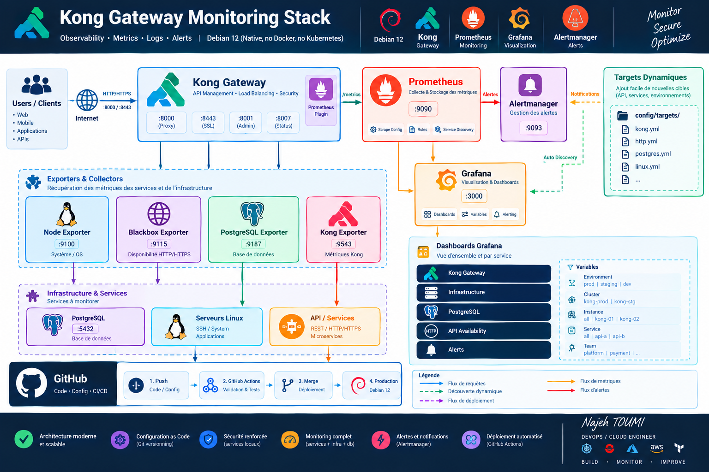

# 🚀 Kong Observability Platform

> Modern, native and extensible observability platform for **Kong Gateway on Debian 12** — Prometheus, Grafana, Alertmanager, Node Exporter, Blackbox Exporter and PostgreSQL Exporter.  
> **No Docker. No Kubernetes. Configuration as Code. Dynamic targets. GitHub Actions.**



## ✨ Highlights

- 🟦 Kong Gateway monitoring through the Prometheus plugin
- 🔴 Prometheus metrics collection and alert rules
- 🟠 Grafana dashboards with reusable variables
- 🟣 Alertmanager notifications
- 🟢 Dynamic target discovery with Prometheus `file_sd_configs`
- 🐘 PostgreSQL monitoring
- 🐧 Linux host monitoring
- 🌐 HTTP/HTTPS endpoint monitoring
- 🔐 Local-first security model
- 🧩 Native `systemd` services
- 🤖 GitHub Actions validation
- 📝 Observability as Code
- 👨‍💻 Signature: **Najeh TOUMI**

## 🏗️ Architecture

```text
                                  ┌───────────────────────┐
                                  │     USERS / CLIENTS   │
                                  │   Web • Mobile • API  │
                                  └───────────┬───────────┘
                                              │ HTTP/HTTPS
                                              ▼
                                  ┌───────────────────────┐
                                  │      KONG GATEWAY     │
                                  │  :8000  :8443         │
                                  │  :8001  :8007         │
                                  │  Prometheus Plugin    │
                                  └───────────┬───────────┘
                                              │ /metrics
                                              ▼
                         ┌─────────────────────────────────────┐
                         │             PROMETHEUS              │
                         │              :9090                  │
                         │ Metrics • Rules • File SD • Query  │
                         └───────┬──────────────┬──────────────┘
                                 │              │
                         PromQL  │              │ Alerts
                                 ▼              ▼
                         ┌────────────┐   ┌──────────────┐
                         │  GRAFANA   │   │ ALERTMANAGER │
                         │   :3000    │   │    :9093     │
                         └────────────┘   └──────────────┘

          ┌────────────────────────────────────────────────────────┐
          │                    EXPORTERS                           │
          │ Node :9100 • Blackbox :9115 • PostgreSQL :9187        │
          └───────────────┬───────────────┬────────────────────────┘
                          │               │
                          ▼               ▼
                   Linux / APIs     PostgreSQL :5432

          ┌────────────────────────────────────────────────────────┐
          │                 DYNAMIC TARGETS                        │
          │ targets/production/*.yml  •  targets/staging/*.yml     │
          └──────────────────────┬─────────────────────────────────┘
                                 │
                                 ▼
                         Prometheus File SD

          ┌────────────────────────────────────────────────────────┐
          │                       GITHUB                           │
          │ Push → Actions → Validate → PR → Merge → Deploy       │
          └────────────────────────────────────────────────────────┘
```

## 🎨 Service map

| Service | Role | Port |
|---|---|---:|
| Kong Gateway | API Gateway | 8000 |
| Kong HTTPS | TLS proxy | 8443 |
| Kong Admin API | Administration | 8001 |
| Kong Status API | Metrics/status | 8007 |
| Prometheus | Metrics | 9090 |
| Grafana | Dashboards | 3000 |
| Alertmanager | Alerts | 9093 |
| Node Exporter | Linux metrics | 9100 |
| Blackbox Exporter | HTTP/HTTPS probes | 9115 |
| PostgreSQL Exporter | PostgreSQL metrics | 9187 |
| PostgreSQL | Kong datastore | 5432 |

## 📁 Repository structure

```text
kong-observability-platform/
├── README.md
├── LICENSE
├── CHANGELOG.md
├── .gitignore
├── docs/
│   ├── architecture.md
│   ├── architecture.png
│   ├── operations.md
│   ├── security.md
│   └── troubleshooting.md
├── config/
│   ├── prometheus/
│   │   ├── prometheus.yml
│   │   └── rules/
│   │       ├── kong.yml
│   │       ├── infrastructure.yml
│   │       └── availability.yml
│   ├── alertmanager/
│   │   └── alertmanager.yml.example
│   ├── blackbox/
│   │   └── blackbox.yml
│   └── grafana/
│       ├── datasources/prometheus.yml
│       ├── dashboards/dashboards.yml
│       └── dashboards/kong-overview.json
├── targets/
│   ├── README.md
│   ├── production/
│   │   ├── kong.yml
│   │   ├── apis.yml
│   │   └── postgres.yml
│   └── staging/
│       ├── kong.yml
│       ├── apis.yml
│       └── postgres.yml
├── exporters/
│   ├── node/node_exporter.service
│   ├── blackbox/blackbox_exporter.service
│   └── postgres/
│       ├── postgres_exporter.service
│       └── postgres_exporter.env.example
├── systemd/
│   ├── prometheus.service
│   ├── alertmanager.service
│   └── kong-observability.target
├── scripts/
│   ├── install.sh
│   ├── install-kong.sh
│   ├── configure-kong.sh
│   ├── reload.sh
│   ├── validate.sh
│   ├── healthcheck.sh
│   └── uninstall.sh
└── .github/workflows/
    ├── validate.yml
    └── shellcheck.yml
```

## 🚀 Installation

### 1. Prerequisites

Run as `root` on Debian 12:

```bash
apt update
apt install -y curl wget tar gzip jq ca-certificates gnupg lsb-release \
  apt-transport-https openssl git shellcheck
```

Verify:

```bash
cat /etc/os-release
uname -m
systemctl --version
```

### 2. Kong Gateway

If Kong is already installed, **do not reinstall it**.

For a new server, use the official Kong Debian package repository. Kong currently publishes Debian packages and recommends its `packages.konghq.com` repository. Check the official documentation before pinning a production version.

Example repository setup:

```bash
curl -1sLf \
  "https://packages.konghq.com/public/gateway-316/gpg.998DFF461A62FF7C.key" \
  | gpg --dearmor \
  > /usr/share/keyrings/kong-gateway-316-archive-keyring.gpg

curl -1sLf \
  "https://packages.konghq.com/public/gateway-316/config.deb.txt?distro=debian&codename=$(lsb_release -sc)" \
  > /etc/apt/sources.list.d/kong-gateway-316.list

apt update
apt install -y kong
```

Then configure PostgreSQL and Kong before starting the gateway.

> This repository is focused on observability. `scripts/install-kong.sh` is optional and should only be used on a new host.

### 3. Configure Kong Status API

In `/etc/kong/kong.conf`:

```ini
status_listen = 127.0.0.1:8007
```

Validate:

```bash
kong check /etc/kong/kong.conf
systemctl restart kong
curl -i http://127.0.0.1:8007/
```

### 4. Enable the Prometheus plugin

Check:

```bash
curl -s http://127.0.0.1:8001/plugins | jq \
'.data[] | select(.name=="prometheus")'
```

If absent:

```bash
curl -i -X POST http://127.0.0.1:8001/plugins \
  --header 'Content-Type: application/json' \
  --data '{
    "name": "prometheus",
    "config": {
      "status_code_metrics": true,
      "latency_metrics": true,
      "bandwidth_metrics": true,
      "upstream_health_metrics": true
    }
  }'
```

Validate:

```bash
curl -fsS http://127.0.0.1:8007/metrics | grep '^kong_' | head
```

### 5. Install the monitoring platform

Clone the repository:

```bash
git clone https://github.com/<YOUR_GITHUB_USER>/kong-observability-platform.git
cd kong-observability-platform
```

Run:

```bash
chmod +x scripts/*.sh
./scripts/install.sh
```

The installer creates native `systemd` services for:

- Prometheus
- Alertmanager
- Node Exporter
- Blackbox Exporter
- PostgreSQL Exporter

Grafana is installed from the official Grafana APT repository.

### 6. Configure PostgreSQL Exporter

Copy:

```bash
cp exporters/postgres/postgres_exporter.env.example \
   /etc/default/postgres_exporter

chmod 600 /etc/default/postgres_exporter
nano /etc/default/postgres_exporter
```

Create a least-privilege PostgreSQL monitoring account appropriate for your PostgreSQL version and exporter collectors.

### 7. Add monitoring targets

Edit:

```text
targets/production/kong.yml
targets/production/apis.yml
targets/production/postgres.yml
```

Example API:

```yaml
- targets:
    - https://api.example.com/health
  labels:
    environment: production
    service: customer-api
    team: platform
```

Reload:

```bash
./scripts/reload.sh
```

No Prometheus restart is required for file-based target changes.

### 8. Validate

```bash
./scripts/validate.sh
./scripts/healthcheck.sh
```

Open:

```text
Grafana:      http://SERVER_IP:3000
Prometheus:   http://127.0.0.1:9090
Alertmanager: http://127.0.0.1:9093
```

## 🔄 Dynamic target model

Prometheus uses `file_sd_configs`.

This means a new API can be added with a Git change:

```yaml
- targets:
    - https://api-new.example.com/health
  labels:
    environment: production
    service: api-new
```

Then:

```bash
git add targets/
git commit -m "feat: monitor api-new"
git push
```

After deployment/reload, Prometheus discovers the new target.

## 🔐 Security

Recommended local bindings:

```text
127.0.0.1:8001
127.0.0.1:8007
127.0.0.1:9090
127.0.0.1:9093
127.0.0.1:9100
127.0.0.1:9115
127.0.0.1:9187
```

Expose Grafana only through your approved network path.

Never commit:

```text
.env
*.secret
*.pem
*.key
passwords
tokens
real PostgreSQL credentials
```

## 🤖 GitHub Actions

Every pull request validates:

- YAML syntax
- Prometheus configuration
- Prometheus rules
- Grafana JSON
- shell scripts

Workflow files are in:

```text
.github/workflows/
```

Recommended flow:

```text
Developer
   │
   ▼
Git commit
   │
   ▼
GitHub Pull Request
   │
   ▼
GitHub Actions
   │
   ├── YAML validation
   ├── Prometheus validation
   ├── Grafana JSON validation
   └── ShellCheck
   │
   ▼
Merge
   │
   ▼
Deployment / reload
```

## 📊 Grafana dashboards

The repository contains a Kong overview dashboard with:

- Request rate
- HTTP status distribution
- Kong availability
- Node CPU
- Node memory
- Filesystem usage
- Exporter availability
- Dynamic environment/instance/service filters

Dashboard variables:

```text
environment
instance
service
team
```

## 🧪 Useful commands

```bash
systemctl status kong prometheus grafana-server --no-pager
systemctl status alertmanager node_exporter blackbox_exporter postgres_exporter --no-pager

curl -fsS http://127.0.0.1:8007/metrics
curl -fsS http://127.0.0.1:9090/-/ready
curl -fsS http://127.0.0.1:9093/-/ready
curl -fsS http://127.0.0.1:9100/metrics
curl -fsS http://127.0.0.1:9115/metrics
curl -fsS http://127.0.0.1:9187/metrics
```

## 👨‍💻 Author

**Najeh TOUMI**  
DevOps / Cloud Engineer

> Build • Monitor • Improve

## 📚 Official documentation

- Kong Gateway: https://developer.konghq.com/gateway/
- Prometheus: https://prometheus.io/docs/
- Grafana: https://grafana.com/docs/
- Alertmanager: https://prometheus.io/docs/alerting/latest/alertmanager/
- Node Exporter: https://github.com/prometheus/node_exporter
- Blackbox Exporter: https://github.com/prometheus/blackbox_exporter
- PostgreSQL Exporter: https://github.com/prometheus-community/postgres_exporter
