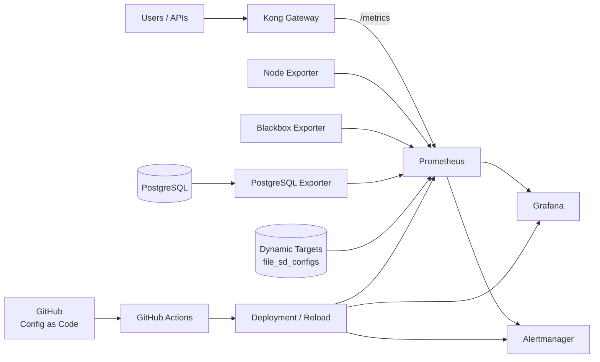

# Architecture

## Logical flow

```mermaid
flowchart LR
    U[Users / APIs] --> K[Kong Gateway]
    K -->|/metrics| P[Prometheus]
    P --> G[Grafana]
    P --> A[Alertmanager]

    N[Node Exporter] --> P
    B[Blackbox Exporter] --> P
    PG[PostgreSQL Exporter] --> P

    DB[(PostgreSQL)] --> PG

    T[(Dynamic Targets<br/>file_sd_configs)] --> P

    GH[GitHub<br/>Config as Code] --> CI[GitHub Actions]
    CI --> D[Deployment / Reload]
    D --> P
    D --> G
    D --> A
```

## Layers

1. Traffic
2. API Gateway
3. Metrics
4. Exporters
5. Visualization
6. Alerting
7. Configuration as Code
8. CI/CD
